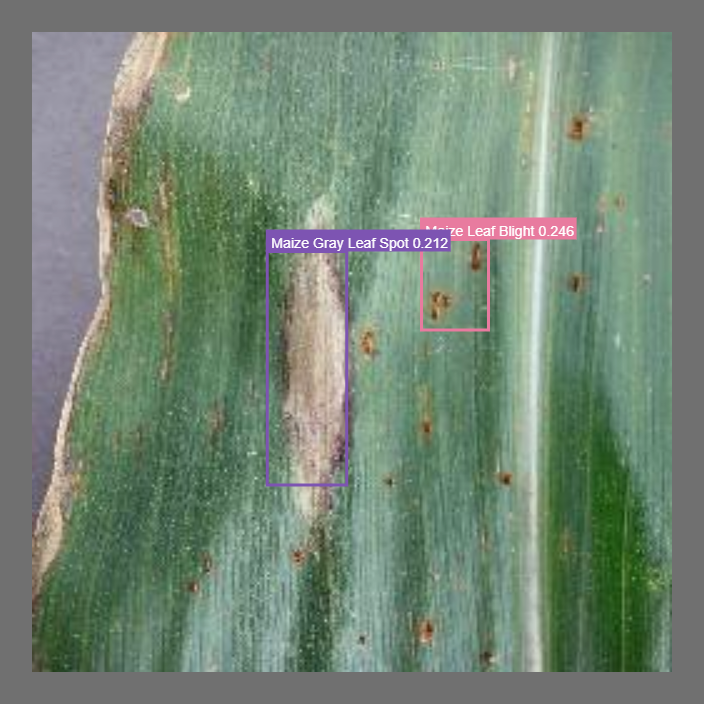

# ⚠️⚠️⚠️ Notice ⚠️⚠️⚠️⚠️

> Taking an "untill further notice" on this. Probably going to play with other shiny toys.

# Nebo

> Nebo is a noun meaning the Babylonian god of wisdom and agriculture and patron of scribes and schools

### Introduction

This project aims to combine computer vision and natural language processing to build a tool that can be used by anyone (from agricultural researchers, farmers, and hobbyists).

Using object detection, the prediction and localization of plant disease can be easily detected, and further combining this with question answering model feeding questions about the pathogen, the user gets to learn about what's ailing the crops, how to treat them, and a whole range of other agricultural-related questions.

<p align="center">
 
</p>

## Training

The dataset currently used to train the model is custom-built (a small sample, I couldn't find publicly available annotated datasets for this particular use case).

### Some metrics (visualized with W&B):


# Getting started

## Docker

To set up the environment to run the code in this repository, follow the instructions below.

1. Install docker (avoid the "it works on my machine 😅")

```bash
# Download Docker
curl -fsSL get.docker.com -o get-docker.sh
# Install Docker using the stable channel (instead of the default "edge")
CHANNEL=stable sh get-docker.sh
# Remove Docker install script
rm get-docker.sh
```

2. Install docker compose

```bash
sudo curl -L "https://github.com/docker/compose/releases/download/1.29.2/docker-compose-$(uname -s)-$(uname -m)" -o /usr/local/bin/docker-compose

```

3. Clone the repository (if you haven't already!), and navigate to the `box_of_crayons` folder, then use docker-compose to start the application.

Using recursive so as to pull in other dependent repos. (Can be ommitted if the interest is only this repo).

```bash
git clone --recursive https://github.com/mrdvince/box_of_crayons.git

cd box_of_crayons
```

> NB: You might have to set a couple of env variables

4. Start the application.

```bash
docker-compose up -d
```

this will pull and build all the images required to run the containers and finally start it.

# Kubernetes

> Setting this up on a single node but can be easily scaled to as much nodes as you want/can afford to pay for.

I don't have much experience with kubernetes but here's a small guide to setup a minimal CI/CD pipeline for the project using [k3s](https://k3s.io/), [argocd](https://argo-cd.readthedocs.io/en/stable/) and Github Actions.

> Skipping setting up wildcard certs, rancher, secrets and config maps

1. Start by setting up k3s (k3s is a rancher's lightweight kubernetes distribution, and yes it's completely production ready)

```bash
curl -sfL https://get.k3s.io | INSTALL_K3S_EXEC="--node-ip=<internal ip> --flannel-iface=eth0 --write-kubeconfig-mode=644 --node-external-ip=<public ip>" sh -
# This will pull k3s, install and set it up to autostart on system startup (pretty darn cool).
# Run to see your node/nodes
kubectl get nodes -o wide
```

2. Install argocd

```bash
# Create argocd namespace
kubectl create namespace argocd
# This should apply the argocd manifest to your cluster
kubectl apply -n argocd -f https://raw.githubusercontent.com/argoproj/argo-cd/v2.1.7/manifests/install.yaml

```

> k3s comes with traefik as the ingress controller, to be able to access the argocd gui
> on a your custom domain of choice [follow this guide](https://argo-cd.readthedocs.io/en/stable/operator-manual/ingress/#ingressroute-crd) to set up an ingress route for the argocd server.

3. Use github actions to build your container image.

In the github workflows folder uncomment and edit the file to your needs, setup secrets for the repo in the repo settings folder.

On pull request this will build the container image and push to the registry of choice. It doesn't have to be on PR, feel free to use any event that you like.

4.  Edit the deploy yaml files.
    This uses kustomize to deploy either in dev or in production. - Update the dployment file image.

        ```bash
            optional: false
            image: <registry>/<container image> # change this to the container image built
            imagePullPolicy: Always
        ```
        - Update ingress

        ```bash
            spec:
                rules:
                - host: prod.api.<domain name> # your domain name
                    http:
                    paths:
                    - backend:
        ```

5.  Build container image with Github Actions
    Commit and push the repo to your repo on Github

Open a PR on github and Github Actions should build and push the container image to your registry

6. Deploy with argocd.
   Follow [this guide](https://www.youtube.com/watch?v=UzCacg8aPRQ&t=396s) on how to use kustomize and argocd to deploy the app.

Argocd from now on will be taking care of all your deployments.

When finished you should have something that looks like the image below.


# More screenshots

Who doesn't love more screenshots 😂😂 (they do make a README look pretty sleek if you ask me.)

W&B evaluation summary table, showing the ground truth, prediction and avg confidence

<p align="center">

</p>

Sample image showing a single disease classification

<p align="center">

</p>

Random image evalution screenshots.

<p align="center">
 
</p>

<p align="center">
 
</p>
